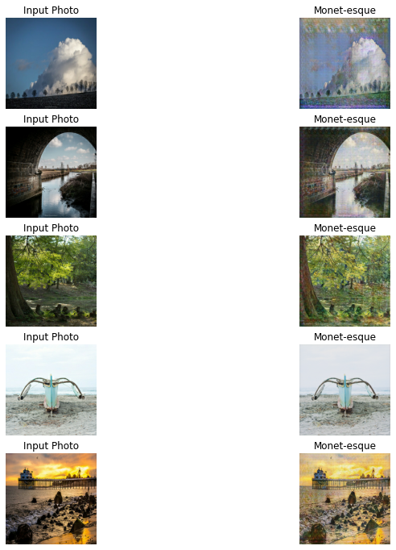

### monet-paint
Build a Generative Adverserial Network(GAN) that generates Monet-style images 

#### Dataset

The input dataset has been collected from Kaggle competition: **[I’m Something of a Painter Myself](https://www.kaggle.com/c/gan-getting-started)** 

data link: [here](https://www.kaggle.com/c/gan-getting-started/data)

#### Evaluation
**MiFID**(Memorization-informed Fréchet Inception Distance)

The smaller MiFID is, the better the generated images are. 

#### Model Architechture

CycleGAN
Generator:  UNet architechture   

#### Monet paint result

